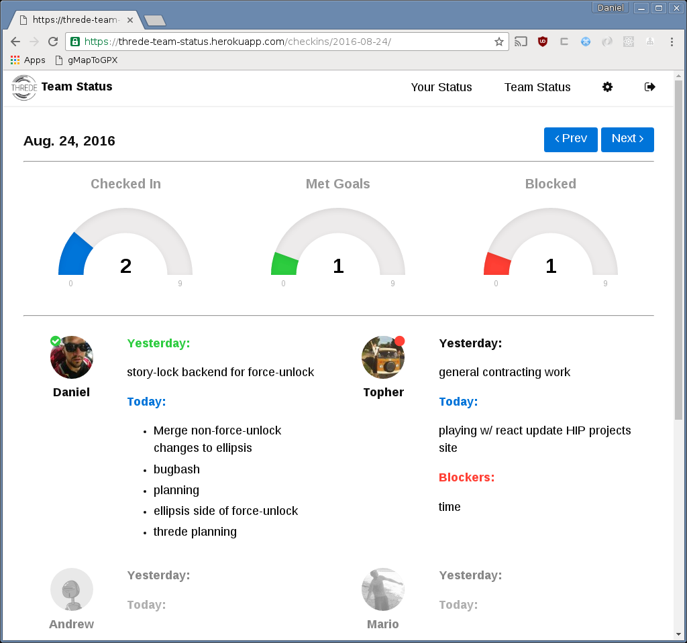

# OpenTeamStatus - an opensource StatusHero clone

Veerry much a work in progress.

It's a basic CRUD django app.

```
mkvirtualenv --python=/usr/bin/python3 status
pip install -r requirements.txt
./manage.py migrate
./manage.py createsuperuser
./manage.py runserver
```

Avatars made with gravatar/robohash. Because robohash is awesome.

## Screenshot


## Docker!
There's a basic Dockerfile, here's a basic example of running it..
```
docker build -t openteamstatus .
docker run -it --rm \
    -v $PWD/db.sqlite3:/opt/openteamstatus/db.sqlite3:z \
    openteamstatus ./manage.py migrate
docker run -it --rm \
    -v $PWD/db.sqlite3:/opt/openteamstatus/db.sqlite3:z \
    openteamstatus ./manage.py createsuperuser
docker run -it --rm -e ALLOWED_HOSTS=localhost -p 8000:80 \
    -v $PWD/db.sqlite3:/opt/openteamstatus/db.sqlite3:z \
    openteamstatus
```
